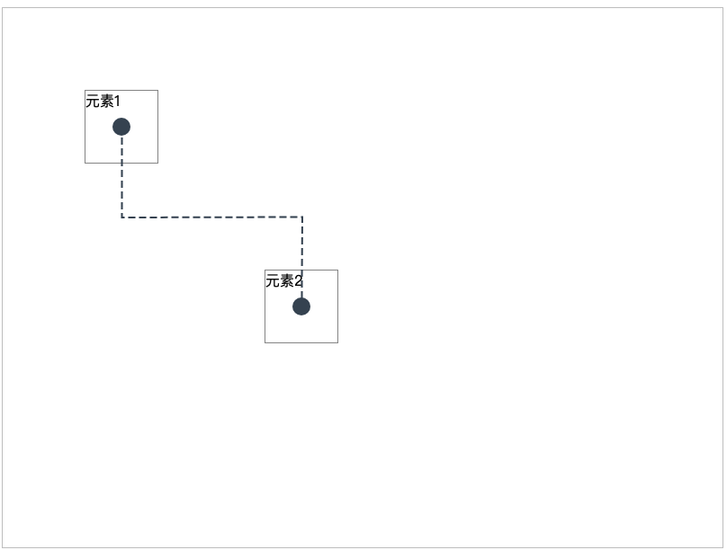

# 使用jsPlumb绘制虚线连接线

## 简介

jsPlumb是一个强大的JavaScript库，用于在网页元素之间创建可视化连接。本文将介绍如何使用jsPlumb创建虚线样式的连接线。

## 基本设置

首先需要引入jsPlumb库：
```html
<script src="https://cdnjs.cloudflare.com/ajax/libs/jsPlumb/2.15.6/js/jsplumb.min.js"></script>
```

初始化jsPlumb实例：

```javascript
const jsPlumbInstance = jsPlumb.getInstance({
    Container: "diagramContainer"
});
```

## 创建虚线连接

### 方法一：使用 paintStyle

```javascript
jsPlumbInstance.connect({
    source: "element1",
    target: "element2",
    paintStyle: {
        stroke: "#456", // 线条颜色
        strokeWidth: 2, // 线条宽度
        dashstyle: "2 2" // 虚线样式：2像素线段，2像素间隔
    }
});
```

### 方法二：使用 Connector 配置

```javascript
jsPlumbInstance.connect({
    source: "element1",
    target: "element2",
    connector: ["Flowchart", {
        stub: 30,
        gap: 10,
        cornerRadius: 5,
        alwaysRespectStubs: true
    }],
    paintStyle: {
        stroke: "#456",
        strokeWidth: 2,
        dashstyle: "4 2" // 4像素线段，2像素间隔
    }
});
```

## 高级配置

### 自定义虚线样式

```javascript
const connection = jsPlumbInstance.connect({
    source: "element1",
    target: "element2",
    paintStyle: {
        stroke: "#456",
        strokeWidth: 2,
        dashstyle: "4 2 1 2" // 复杂虚线模式
    },
    // 鼠标悬停样式
    hoverPaintStyle: {
        stroke: "#789",
        strokeWidth: 3,
        dashstyle: "4 2"
    }
});
```

### 动态更新虚线样式

```javascript
// 更新已存在连接的样式
connection.setPaintStyle({
    stroke: "#123",
    strokeWidth: 2,
    dashstyle: "5 2"
});
```

## 完整示例

```html
<!DOCTYPE html>
<html>
<head>
    <style>
        .diagram-container {
            width: 800px;
            height: 600px;
            border: 1px solid #ccc;
        }
        .element {
            width: 80px;
            height: 80px;
            border: 1px solid #999;
            position: absolute;
        }
    </style>
</head>
<body>
    <div id="diagramContainer" class="diagram-container">
        <div id="element1" class="element" style="left:100px; top:100px;">元素1</div>
        <div id="element2" class="element" style="left:300px; top:300px;">元素2</div>
    </div>

    <script src="https://cdnjs.cloudflare.com/ajax/libs/jsPlumb/2.15.6/js/jsplumb.min.js"></script>
    <script>
        jsPlumb.ready(function() {
            const instance = jsPlumb.getInstance({
                Container: "diagramContainer"
            });

            instance.connect({
                source: "element1",
                target: "element2",
                anchor: ["Center", "Center"],
                connector: ["Flowchart"],
                paintStyle: {
                    stroke: "#456",
                    strokeWidth: 2,
                    dashstyle: "4 2"
                },
                endpoint: "Dot"
            });
        });
    </script>
</body>
</html>
```

### 效果


## 注意事项

1. **虚线格式**：
   - dashstyle属性接受一个字符串，表示虚线模式
   - 数字间用空格分隔
   - 第一个数字表示线段长度，第二个数字表示间隔长度

2. **性能考虑**：
   - 虚线渲染比实线需要更多计算资源
   - 当连接线较多时，建议适当调整虚线间隔

3. **浏览器兼容性**：
   - 确保在不同浏览器中测试虚线效果
   - 某些旧版浏览器可能不支持复杂的虚线模式

## 最佳实践

1. 为了更好的可维护性，建议将连接样式配置集中管理：

```javascript
const connectorStyles = {
    default: {
        stroke: "#456",
        strokeWidth: 2,
        dashstyle: "4 2"
    },
    highlighted: {
        stroke: "#789",
        strokeWidth: 3,
        dashstyle: "6 2"
    }
};

// 使用配置
instance.connect({
    source: "element1",
    target: "element2",
    paintStyle: connectorStyles.default,
    hoverPaintStyle: connectorStyles.highlighted
});
```

2. 添加交互效果：

```javascript
// 点击连接线切换样式
instance.bind("click", function(conn) {
    conn.setPaintStyle({
        stroke: "#f00",
        dashstyle: "2 2"
    });
});
```

## 总结

jsPlumb提供了灵活的方式来创建和自定义虚线连接。通过合理配置paintStyle和dashstyle属性，可以实现各种虚线效果。在实际应用中，需要根据具体需求和性能要求来选择合适的虚线样式。